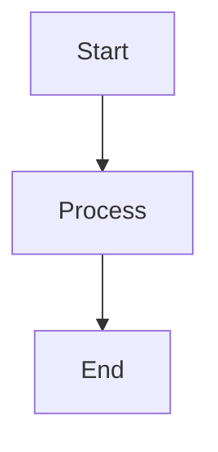

# Markdown Confluence Reference

## Complete Configuration Options

### Config File Structure (`.markdown-confluence.json`)

```json
{
  "confluence": {
    "base_url": "https://betfanatics.atlassian.net",
    "parent_id": "1394901392",
    "username": "tyler.stapler@betfanatics.com",
    "space_key": "OPTIONAL_SPACE_KEY"
  },
  "publish": {
    "folder_to_publish": ".",
    "frontmatter_from_document_start": true,
    "skip_metadata": false,
    "use_file_path_as_title": false,
    "prepend_file_path_to_title": false,
    "resolve_relative_links": true,
    "respect_link_dependencies": true
  }
}
```

### Configuration Fields Explained

| Field | Type | Description |
|-------|------|-------------|
| `base_url` | string | Confluence instance URL |
| `parent_id` | string | Root parent page ID for all published content |
| `username` | string | Atlassian username (email) |
| `space_key` | string | Optional Confluence space key |
| `folder_to_publish` | string | Relative path to publish (default: `.`) |
| `frontmatter_from_document_start` | bool | Parse frontmatter from file start |
| `skip_metadata` | bool | Skip metadata panel in output |
| `use_file_path_as_title` | bool | Use file path as page title |
| `prepend_file_path_to_title` | bool | Prepend file path to title |
| `resolve_relative_links` | bool | Convert relative links to Confluence links |
| `respect_link_dependencies` | bool | Publish in dependency order |

## Environment Variables

| Variable | Required | Description |
|----------|----------|-------------|
| `ATLASSIAN_API_TOKEN` | Yes | API token for authentication |
| `CONFLUENCE_BASE_URL` | No* | Overrides config file |
| `CONFLUENCE_PARENT_ID` | No* | Overrides config file |
| `ATLASSIAN_USER_NAME` | No* | Overrides config file |

*These override config file values when set

## CLI Command Reference

### publish

```bash
markdown-confluence publish SOURCE [OPTIONS]

Options:
  --config TEXT               Config file path (default: .markdown-confluence.json)
  -v, --verbose               Increase verbosity (-v for info, -vv for debug)
  --dry-run                   Preview without publishing
  --pattern TEXT              Include glob pattern (e.g., "**/*.md")
  --exclude TEXT              Exclude glob pattern (e.g., "**/node_modules/**")
  --force                     Force update unchanged content
  --fail-fast                 Stop on first error
  --delete-archived           Delete archived pages
  --force-title-match         Duplicate detection by title only
  --event-driven              Use event-driven processing (default: enabled)
  --diagnostic                Enable detailed error info
  --force-hierarchy           Use directory structure for hierarchy
  --update-frontmatter        Update frontmatter with corrected parent IDs
  --sync / --no-sync          Check remote changes before publish
  --auto-resolve-conflicts    Auto-resolve conflicts
  --prefer-remote             Prefer remote changes in conflicts
  --private                   Restrict page to current user
  --restrict-read TEXT        Restrict read access (user:id or group:name)
  --restrict-update TEXT      Restrict update access
```

### crawl page

```bash
markdown-confluence crawl page PAGE_ID_OR_URL [OPTIONS]

Options:
  -o, --output PATH    Output directory [required]
  --config TEXT        Config file path
  -v, --verbose        Increase verbosity
```

### crawl page-tree

```bash
markdown-confluence crawl page-tree PAGE_ID_OR_URL [OPTIONS]

Options:
  -o, --output PATH      Output directory [required]
  --max-depth INTEGER    Maximum depth (default: unlimited)
  --config TEXT          Config file path
  -v, --verbose          Increase verbosity
```

### crawl page-versions

```bash
markdown-confluence crawl page-versions PAGE_ID [OPTIONS]

Options:
  --compare TEXT      Version numbers to compare (e.g., "11,12")
  --output PATH       Output directory
  -v, --verbose       Increase verbosity
```

### handle-deleted

```bash
markdown-confluence handle-deleted [OPTIONS]

Options:
  --config TEXT       Config file path
  --action TEXT       Action: "report" or "delete"
```

### validate-links

```bash
markdown-confluence validate-links [OPTIONS]

Validate links between Markdown files and report broken links.
```

## Frontmatter Complete Reference

```markdown
---
# Page identification
connie-title: "Custom Title"           # Override page title
connie-page-id: "123456"               # Existing page ID (auto-set after first publish)

# Hierarchy control
connie-parent-id: "789012"             # Set/move to parent page
connie-parent-page-id: "789012"        # Alternative field name

# Publishing control
connie-publish: true                   # false to skip publishing

# Link handling
connie-skip-link-resolution: false     # true to exclude from link graph
---
```

## Debug Tools

Located in `tools/markdown_confluence/debug_tools/`:

| Tool | Purpose |
|------|---------|
| `download_confluence_pages.py` | Download pages for inspection |
| `fix_page_format.py` | Repair corrupted page formats |
| `compare_page_formats.py` | Compare storage vs ADF formats |
| `analyze_failing_page.py` | Diagnose publishing issues |
| `analyze_links.py` | Visualize link dependencies |

### Example: Fix Corrupted Parent Page

```bash
cd /Users/tylerstapler/Documents/personal-wiki/tools/markdown_confluence
uv run python debug_tools/fix_page_format.py \
  --config=/path/to/.markdown-confluence.json \
  --page-id=PARENT_PAGE_ID
```

## Error Handling

### Common Errors

| Error | Cause | Solution |
|-------|-------|----------|
| 400 Bad Request | Corrupted parent page | Use `fix_page_format.py` |
| Duplicate title | Title already exists | Add unique `connie-title` |
| Page not found | Invalid page ID | Tool auto-creates new page |
| Space key required | Missing space info | Add `space_key` to config |
| Version not incrementing | No content change | Use `--force` flag |

### Recovery Strategies

1. **Corrupted Parent Page**
   ```bash
   uv run python debug_tools/fix_page_format.py --page-id=PARENT_ID
   ```

2. **Archived Page Blocking**
   ```bash
   markdown-confluence publish . --delete-archived
   ```

3. **Cascading Failures**
   ```bash
   markdown-confluence publish . --fail-fast
   # Fix root cause, then retry
   ```

## Link Resolution

The tool automatically converts:

- Relative links: `[Doc B](./doc_b.md)` → Confluence page link
- Wikilinks: `[[Page Name]]` → Confluence page link
- Titled wikilinks: `[[Page Name|Display Text]]` → Link with custom text

### Dependency-Aware Publishing

When `respect_link_dependencies: true`:
1. Tool analyzes link graph
2. Publishes pages in dependency order
3. Ensures linked pages exist before linking page

## Mermaid Diagrams

Mermaid diagrams are automatically rendered to images:

```markdown

```

The tool renders the diagram and uploads as an attachment.

## Asset Handling

- Images referenced in markdown are automatically uploaded
- Paths are converted to Confluence attachment references
- Content hashing prevents duplicate uploads

## Caching

The tool caches:
- Content hashes (skip unchanged pages)
- Asset uploads (prevent duplicates)
- Link resolution results

Clear cache if needed:
```bash
markdown-confluence cache clear
```
