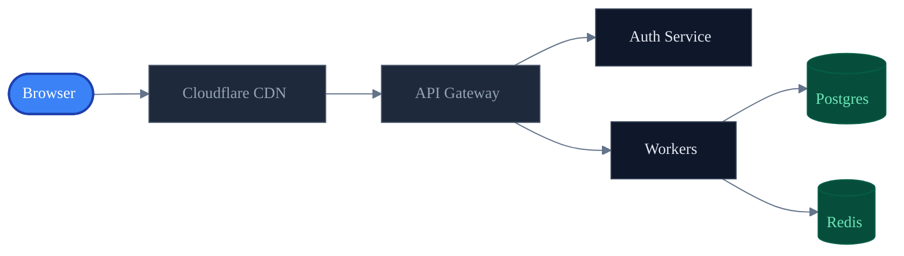
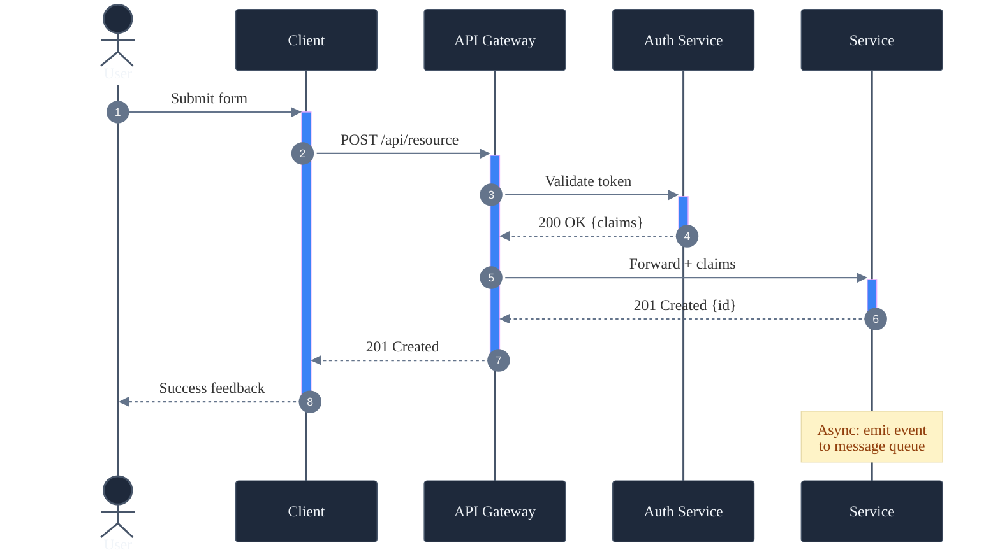
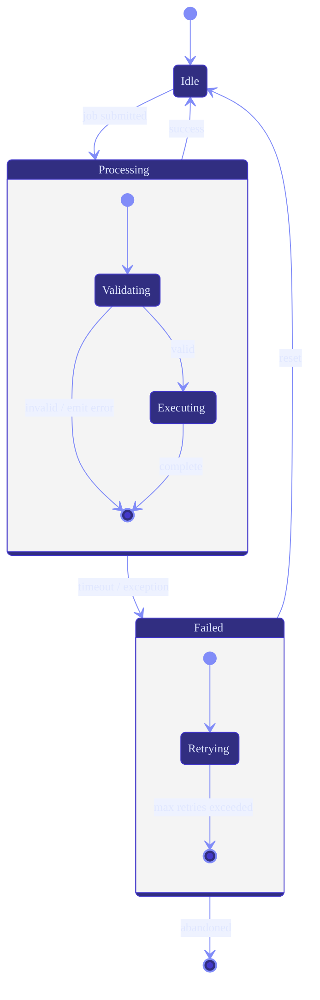
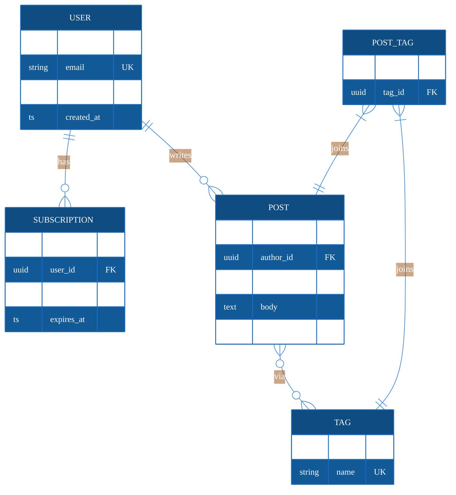

# Mermaid Diagram Templates

Four production-ready templates. Copy, adapt labels/nodes, done.

---

## Template A: Architecture Flowchart (LR, dark palette)

---

## Template B: API Sequence Diagram

---

## Template C: State Machine

---

## Template D: ER / Database Schema

---

## Node Shape Reference

| Shape | Syntax | Use For |
|---|---|---|
| Rectangle | `A[Label]` | Default / process step |
| Rounded rect | `A(Label)` | Start / end / soft step |
| Stadium | `A([Label])` | Terminal / endpoint |
| Subroutine | `A[[Label]]` | Called function / module |
| Cylinder | `A[(Label)]` | Database / storage |
| Circle | `A((Label))` | Event / junction |
| Diamond | `A{Label}` | Decision / condition |
| Hexagon | `A{{Label}}` | Preparation step |
| Parallelogram | `A[/Label/]` | Input / output |
| Trapezoid | `A[/Label\]` | Manual input |

## ER Relationship Reference

| Syntax | Meaning |
|---|---|
| `\|\|--\|\|` | Exactly one — exactly one |
| `\|\|--o{` | Exactly one — zero or more |
| `}o--o{` | Zero or more — zero or more |
| `\|{--\|\|` | One or more — exactly one |
